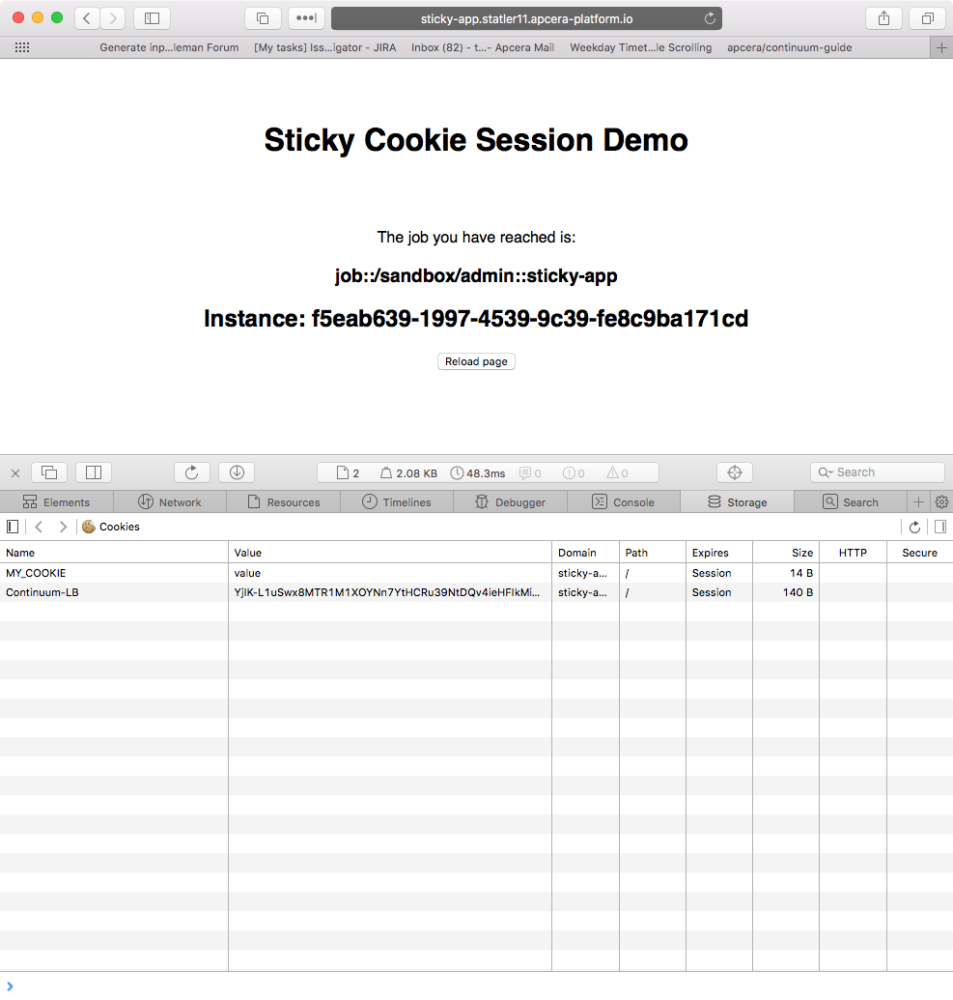

## Sticky session cookie demo application

This application demonstrates how to deploy an application using sticky session cookies so that all request a web browser are routed to the same back-end job instance.

The demo PHP application displays uses environment variables set on job instances to display the UUID of the job instance that handled the request, as well as the FQN of the job definition. It also sets a cookie named `MY_COOKIE`, which matches the name of the sticky session cookie you set on the application.


```html
<html>
    <head><title>Sticky Cookie Session Demo</title></head>
    <body style="font-family: helvetica;">
        <div style="margin: auto; text-align: center;">
            <br><br>
            <h1>Sticky Cookie Session Demo</h1>
            <br><br>
            <?php

                // Cookie value is not significant
                setcookie("MY_COOKIE", "value");

                echo "<p>The job you have reached is:</p>";
                echo "<h3>" . getenv('CNTM_JOB_FQN') . "<h3>";
                echo "<h2>Instance: " . getenv('CNTM_INSTANCE_UUID') . "</h2>";

            ?>
            <button onclick="reloadPage()">Reload page</button>
            <script>function reloadPage() { location.reload(); }</script>
        </div>
    </body>
</html>
```

Deploy the application with five instance, and set a sticky session cookie named `MY_COOKIE` on the job:

```bash
apc application create sticky-application  \
--sticky-session-cookies=MY_COOKIE \
--routes http://sticky-application.example.com \
--instances 5 \
--start
```

Open the application's route in a web browser and repeatedly reload the page. You should notice, on each load, that the displayed value of the instance UUID stays the same, indicating that all requests are reaching the same job instance. 



As a test try changing the name of the job's sticky session cookie (or deleting it), for example:

```bash
apc application update sticky-application --sticky-session-cookies=NEW_COOKIE
```

Now when you reload the browser page, the Apcera Platform router will randomly route the request to one of the job's five instances, so a different instance UUID will appear.